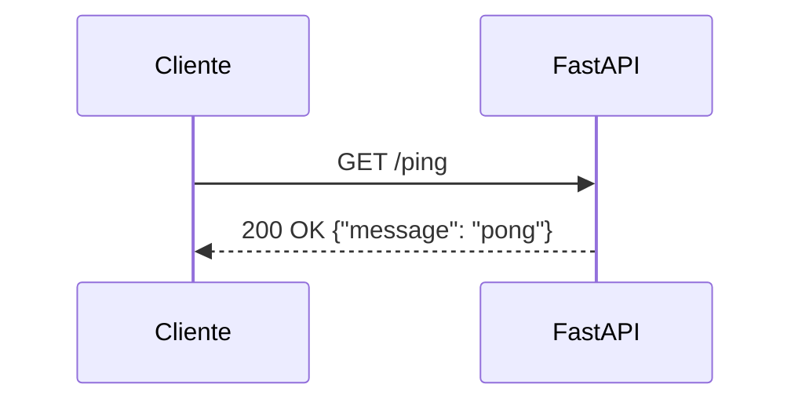
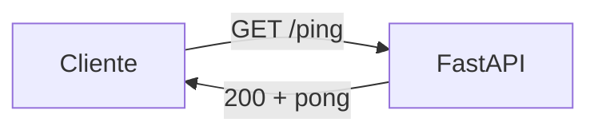

# Fluxo do endpoint `/ping`

```mermaid
sequenceDiagram
    participant C as Cliente
    participant A as FastAPI

    C->>A: GET /ping
    A-->>C: 200 OK {"message": "pong"}
```

Fluxo equivalente:

```mermaid
flowchart LR
    Cliente -->|GET /ping| FastAPI
    FastAPI -->|200 + pong| Cliente
```
